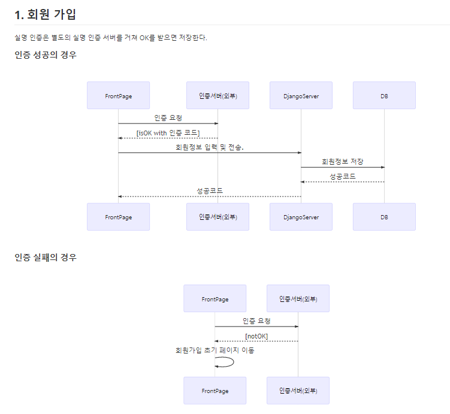
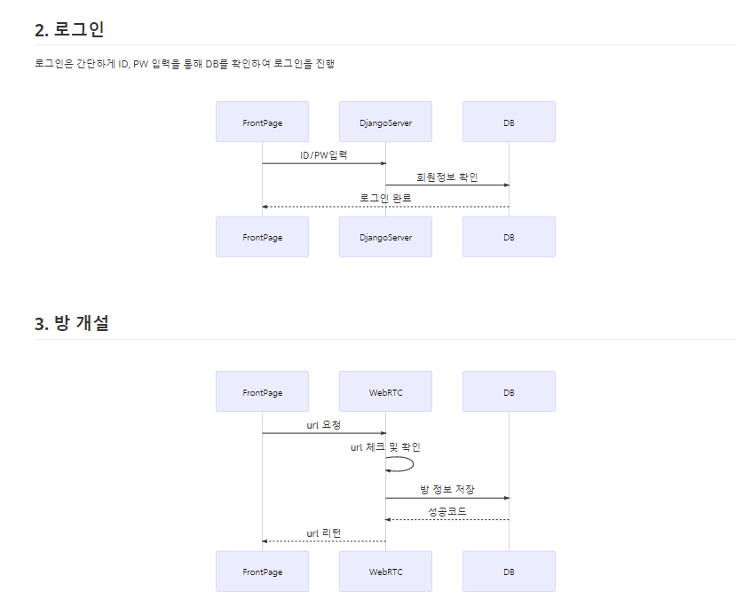
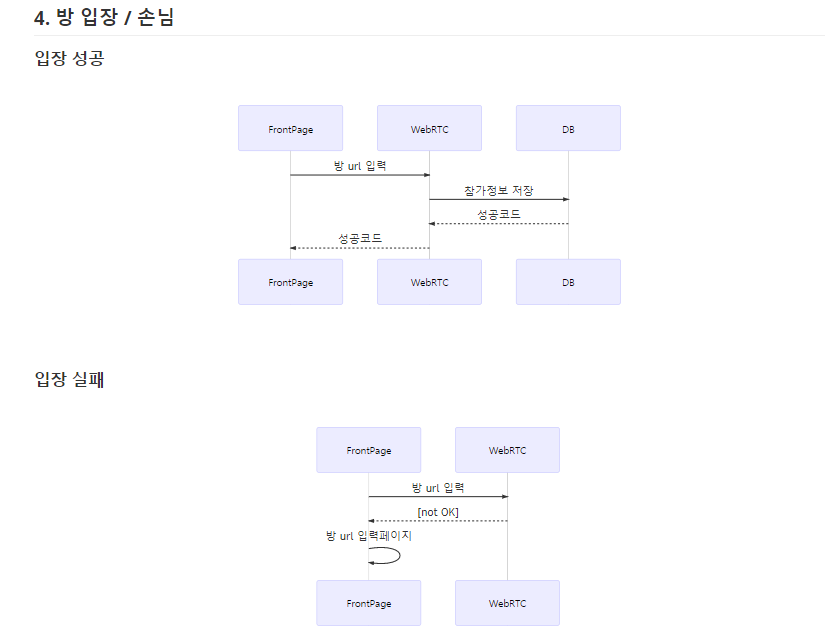
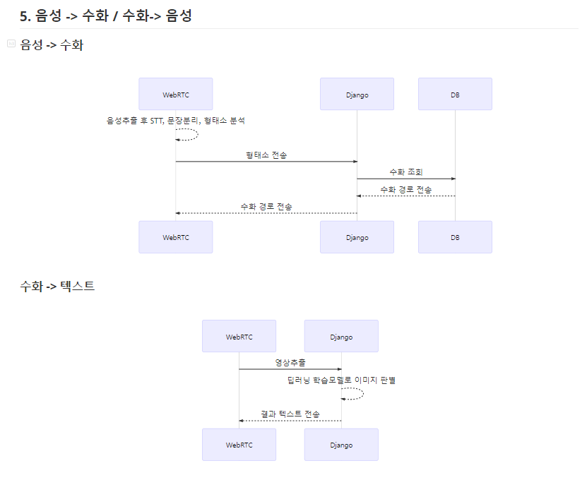

<p align="center">
  
</p>

# VODA(보다 : 보다 더, 넓은 세상을 보다)

> 청각장애인도 사용 할 수 있는 화상미팅서비스

## 목차

- [VODA(보다 : 보다 더, 넓은 세상을 보다)](#voda보다--보다-더-넓은-세상을-보다)
  - [목차](#목차)
  - [개요](#개요)
  - [기능](#기능)
    - [ERD](#erd)
    - [와이어 프레임](#와이어-프레임)
  - [기술 스택](#기술-스택)
  - [기술 설명](#기술-설명)
    - [디렉토리 구조도](#디렉토리-구조도)
    - [시퀀스 다이어그램](#시퀀스-다이어그램)
  - [기타](#기타)
  - [향후 전망](#향후-전망)
  - [테스트 방법](#테스트-방법)

## 개요

> 일반 화상미팅 서비스를 청각 장애가 있는 사용자는 사용하기가 힘듭니다. 실시간 자막 서비스와 수어서비스를 제공함으로써, 장애가 있는 사람도 사용 할 수 있는 서비스를 제공합니다.

## 기능

### ERD


### 와이어 프레임

[와이어프레임 링크](산출물/와이어프레임.pdf)


## 기술 스택

| 개발 언어 | 개발 환경 |     API & 라이브러리     |
| :-------: | :-------: | :----------------------: |
|  Python   |  Django   |          WebRTC          |
|    JS     |  Vue.js   |        TensorFlow        |
|           |  Node.js  |          OpenCV          |
|           |  MariaDB  | Google STT(음성 -> Text) |
|           |           |      KSS(문장 분리)      |
|           |           |       TF handpose        |

## 기술 설명

### 디렉토리 구조도

```
VODA
  └───VODARTC               : 화상 미팅 서비스(WEBRTC)
  │     └───hand            : tensorflow handpose를 이용한 지화 인식
  │     └───voda
  │       └───create        : 로그인 유저 방생성 및 방참가 페이지
  │       └───join          : 비로그인 유저 방참가 페이지
  │
  └───backend               : Django Rest Server
  │     └───account         : 회원가입, 정보, 로그인
  │     └───backend         : Django 설정
  │     └───hand            : tensorflow 사용하여 손 뼈대 이미지 분석
  │     └───room            : 방생성 정보, 회의록 기록, 참가기록
  │     └───stt             : 텍스트 데이터 문장분석, 형태소 분석, 후 수어 영상 경로 리턴
  │
  └───doc                   : readme에 필요한 자료 모음
  │
  └───front                 : vue.js
  │     └───src
  │       └───views         : 메인화면, 로그인, 회원가입, 손님
  │       └───components    : 헤더
  │       └───router        : url 관리
  │
  └───산출물                : 산출물

```

### 시퀀스 다이어그램

[시퀀스다이어그램 링크](산출물/시퀀스다이어그램.md)





## 기타

> 이외에도 프로젝트를 이해하기 위해 필요한 것들을 적어주세요 (팀별 개발표준, API Documentation 등등...)

## 향후 전망

> 부득이한 사정으로 프로젝트에 구현하지는 못했지만 보완할 점이나 추가할 점이 있다면 적어주세요

## 테스트 방법

> 프로젝트를 배포한 url과 테스트하기 위한 계정 ID/PW를 적어주세요

```

```
