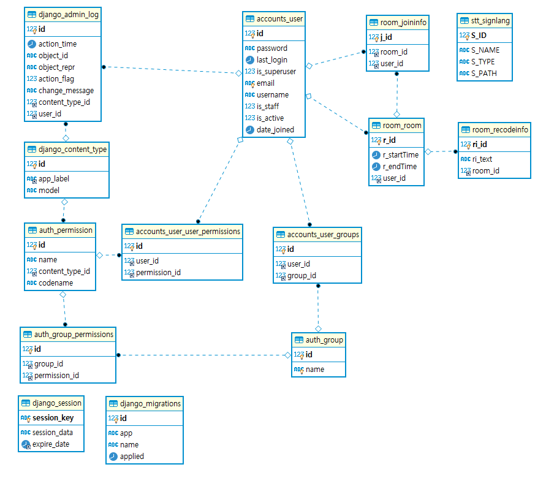

  

# VODA(보다 : 보다 더, 넓은 세상을 보다)

> 청각장애인도 사용 할 수 있는 화상미팅서비스

## 목차

- [VODA(보다 : 보다 더, 넓은 세상을 보다)](#voda보다--보다-더-넓은-세상을-보다)
  - [목차](#목차)
  - [개요](#개요)
  - [기능](#기능)
  - [와이어 프레임](#와이어-프레임)
  - [향후 전망](#향후-전망)
  - [기술 스택](#기술-스택)
  - [기술 설명](#기술-설명)
    - [ERD](#erd)
    - [디렉토리 구조도](#디렉토리-구조도)
    - [시퀀스 다이어그램](#시퀀스-다이어그램)
    - [기타](#기타)
  - [테스트 방법](#테스트-방법)

## 개요

> 일반 화상미팅 서비스를 청각 장애가 있는 사용자는 사용하기가 힘듭니다. 실시간 자막 서비스와 수화서비스를 제공함으로써, 장애가 있는 사람도 사용 할 수 있는 서비스를 제공합니다.

## 기능

## 와이어 프레임

[와이어프레임 링크](산출물/와이어프레임.pdf)

## 향후 전망

> 부득이한 사정으로 프로젝트에 구현하지는 못했지만 보완할 점이나 추가할 점이 있다면 적어주세요

## 기술 스택

| 개발 언어 | 개발 환경 |     API & 라이브러리     |
| :-------: | :-------: | :----------------------: |
|  Python   |  Django   |          WebRTC          |
|    JS     |  Vue.js   |        TensorFlow        |
|           |  Node.js  |          OpenCV          |
|           |  MariaDB  | Google STT(음성 -> Text) |
|           |  Django   |      KSS(문장 분리)      |

## 기술 설명

### ERD

### 디렉토리 구조도

> 폴더 구조가 어떻게 되는지 폴더, 파일별 역할들을 간략하게 적어주세요  
> 너무 자세히 적을 필요는 없습니다

### 시퀀스 다이어그램

[시퀀스다이어그램 링크](산출물/시퀀스다이어그램.md)

### 기타

> 이외에도 프로젝트를 이해하기 위해 필요한 것들을 적어주세요 (팀별 개발표준, API Documentation 등등...)

## 테스트 방법

> 프로젝트를 배포한 url과 테스트하기 위한 계정 ID/PW를 적어주세요
